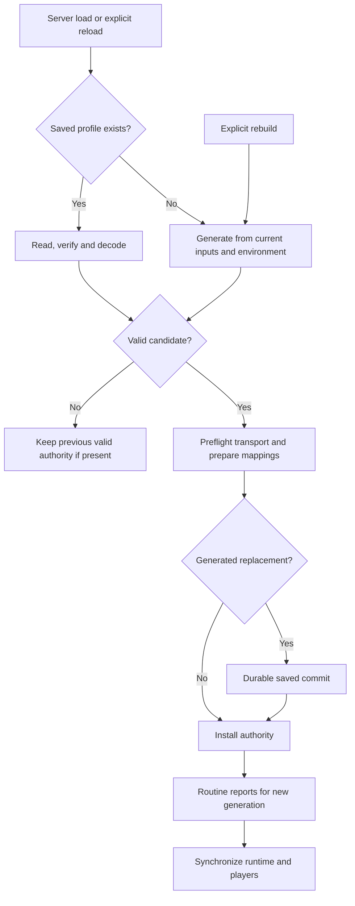

# Balance generation and saved profiles

[Procedural balance](https://github.com/mistaboom/essence_ascendance/wiki/Procedural-Balance) · [Updating and recovery](https://github.com/mistaboom/essence_ascendance/wiki/Updating-and-Recovery)

## The saved profile is the authority

`config/essence_ascendance/generated_balance.json.gz` stores the validated server balance. It includes resolved economy/runtime data and saved evidence/provenance. Human TOML files are generation inputs; CSVs and reports are derived views.

The selection rule is simple: **explicit rebuild, or missing profile → generate; existing profile → load and validate**. Existing invalid data is rejected rather than silently replaced.

Saved loading installs validated saved authority without rewriting it as a newly generated profile. The durable replacement step applies to generated candidates. Routine report generation follows a new install, then runtime/player/item-yield synchronization is attempted; saved reuse skips report regeneration. Explicit export is a separate operation on the active snapshot.

## First generation

Missing inputs are copied from bundled defaults only when absent. Existing inputs are never overwritten.

Generation runs synchronously on the server thread during early Overworld loading, after the level enters the server's map and before initial spawn search generates chunks. It captures current registry/resource/recipe/dimension context, reads supported providers, builds acquisition/supply evidence, solves economy constraints, compares capabilities, and resolves runtime policy.

Audited late recipe-readiness handling exists for Ars Unification. Unsupported/unready recipe namespaces are excluded with diagnostics; this is not generic execution of arbitrary scripts.

Large environments can require substantial time and memory. The generator shares caches and releases intermediate graphs, but there is no universal benchmark or heap recommendation.

## What triggers recalculation?

| Change or action | Actual behavior |
| --- | --- |
| Restart with saved profile | Validates and installs saved data; skips environment discovery and generation |
| Edit either TOML input | No live effect; applies on explicit rebuild |
| Add/remove/update a mod | Existing profile still follows saved reuse; no automatic environment-fingerprint rebuild |
| Datapack/recipe/resource reload | Changed manager identity clears relevant valuation/substrate caches; does not replace the profile |
| `/essence admin mappings reload` | Reinstalls validated saved authority; a missing file can generate |
| `/essence admin balance rebuild` | Generates a replacement using current inputs/environment |
| `/essence debug balance validate` | Validates disk and compares it to active integrity; no install or generation |
| `/essence admin balance export` | Exports saved active evidence exhaustively; no discovery or balance change |

For mod/datapack changes, review and stage a deliberate rebuild. A saved profile may be structurally valid while describing an older environment.

## Validation and mismatches

The current document envelope uses schema **2**, generator `pack-balance-1`, revision `native-equipment-headroom-46` and ordinary dissolution policy `whole_essence_v1`.

Integrity, typed sections, runtime/reference checks, economy invariants and compatibility revision are checked. Unknown required references or incompatible/corrupt data can reject a candidate. There is no automatic profile migration.

Disk/active mismatch is a separate problem: replacing the file externally does not automatically replace installed state. Validation compares them. Plan a reload of a known valid compatible profile or a new rebuild; do not edit compressed JSON to silence integrity errors.

## Commit and failure behavior

A generated candidate is validated, transport-preflighted and mapping-prepared before durable replacement and install. Atomic profile storage uses a sibling temporary file, flushes it and requires atomic replacement. An unsupported atomic move or other commit failure fails closed.

Candidate validation/preflight or durable-write failure keeps previous installed authority where present. If an installation attempt fails around publication, check disk/active agreement rather than assuming a backup was restored: this is failure preservation, not automatic rollback of every file. On fresh startup without authority, the world can continue but dissolution, player Ascension/Attunement and Latent Ore generation are unavailable.

That guard is **not universal**: the standalone Bonus investment command and some core services use the general config fallback. Do not treat a working preview or purchase command as proof that a profile is installed.

After successful install:

- Report export failure does **not** undo installed balance.
- Client synchronization failure does **not** undo installed balance.
- Check report manifest state and client readiness independently.
- Diagnostic failed/uncommitted candidates are investigation artifacts, never installation proof.

## Client synchronization

The server sends resolved runtime on join and replacement, caching the encoded profile and retrying eligible pending sends. Player state, item-yield tables and ore-host catalog synchronize separately. Clients do not receive the complete server acquisition graph.

The runtime protocol is `runtime_balance_v2` with a 512 KiB compressed and 16 MiB inflated limit. Preflight checks transport before replacing authority; it does not negotiate older protocol formats. Use matching client/server mod versions.

The Archive shows loading or unavailable state until its required profile/player data is ready. It does not display bootstrap values as the connected server's authority.

## Rollback is a planned restore

A rejected rebuild retaining old authority is automatic failure preservation. Reverting an already installed rebuild is an explicit restore, described in [updating and recovery](https://github.com/mistaboom/essence_ascendance/wiki/Updating-and-Recovery). Keep inputs, profile, versions and world backups together; restoring only a profile does not undo purchases or activities that occurred afterward.

Source: [selection](https://github.com/mistaboom/essence_ascendance/blob/59e27446afbb6c9e73be38d0d407915fe15354fa/common/src/main/java/com/mistaboom/essence_ascendance/balance/generated/ProfileGenerationSelection.java), [service and commit order](https://github.com/mistaboom/essence_ascendance/blob/59e27446afbb6c9e73be38d0d407915fe15354fa/common/src/main/java/com/mistaboom/essence_ascendance/balance/generated/GeneratedBalanceService.java), [bounded atomic storage](https://github.com/mistaboom/essence_ascendance/blob/59e27446afbb6c9e73be38d0d407915fe15354fa/common/src/main/java/com/mistaboom/essence_ascendance/balance/generated/BalanceProfileStore.java), [runtime sync](https://github.com/mistaboom/essence_ascendance/blob/59e27446afbb6c9e73be38d0d407915fe15354fa/common/src/main/java/com/mistaboom/essence_ascendance/network/RuntimeBalanceSyncService.java).
