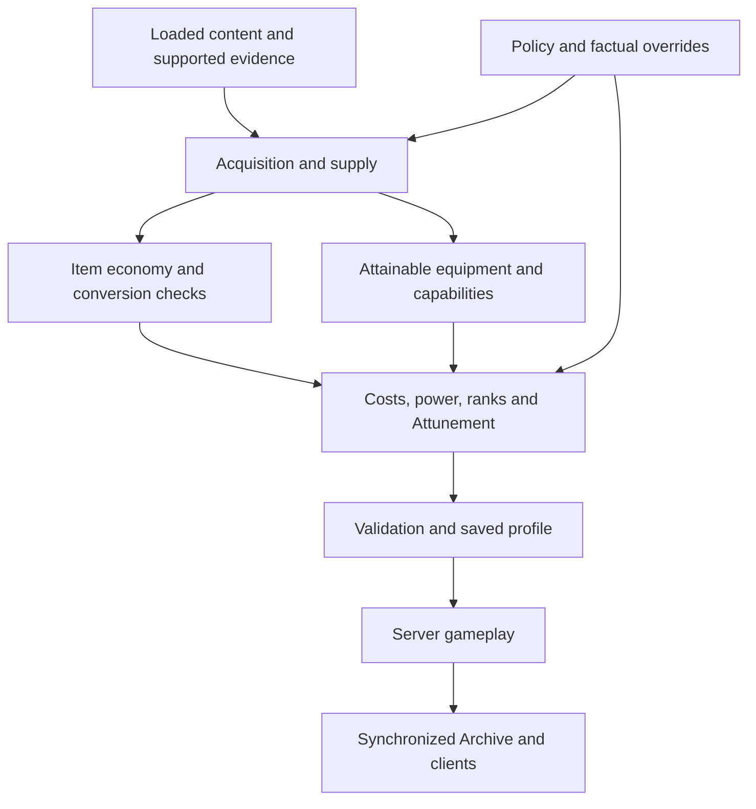

# Procedural balance

[Home](https://github.com/mistaboom/essence_ascendance/wiki/Home) · [Worked scenarios](https://github.com/mistaboom/essence_ascendance/wiki/Worked-Scenarios)

## Why balance depends on the pack

Minecraft packs disagree about what is scarce, what is easy to automate, which equipment is attainable and when major capabilities become available. A fixed price list can reward the wrong resource or leave a progression system irrelevant beside another mod's gear.

Essence Ascendance generates a connected set of values from supported evidence in the server environment. That gives pack makers a useful starting point and an explanation for decisions, while preserving a small set of broad controls and factual overrides.

**Illustrative example:** iron requiring mining and smelting presents a different supply situation from iron supplied by a cheap scalable farm. The generator can lower extractable Essence under automation pressure while still recognizing iron's usefulness as a crafting ingredient. This describes behavior, not a measured result or a promised yield.

## What it adapts

| System | What generation resolves | Why it matters |
| --- | --- | --- |
| Item economy | Eligible item routes, opportunity values and whole Essence yields | Supported supply and conversions influence extraction |
| Equipment | Native tier baselines, harvest access and external references | Ascendance gear has a foundation alongside attainable pack equipment |
| Bonuses | Effects, track costs, useful checkpoints and tier caps | Different functions can have different affordability and headroom |
| Skills | Functional availability, costs, meaningful ranks and parameters | A published rank must improve a supported native effect |
| Attunement | Chapter targets, category breadth, activity calibration and acceleration references | Player Ascension has a generated activity journey |
| Machines/infusion | Costs, capacities, rates and effect policy | Resource generation and consumption use the same saved runtime |
| Latent Ore | Supported hosts/distributions and early supply response | Initial access considers final usable early Essence coverage |

The [Archive](https://github.com/mistaboom/essence_ascendance/wiki/Players-and-the-Archive) shows gameplay reference values from the installed profile. [Reports](https://github.com/mistaboom/essence_ascendance/wiki/Reports-and-Provenance) explain how they were chosen.

## How the systems fit together

Generation shares captured recipes, resources and evidence rather than making unrelated guesses for every subsystem. Costs depend on category supply and effort assumptions. Equipment/capability comparisons inform power headroom; prerequisites and native-unit checks constrain Skill decisions. Conservation can lower proposed yields when a modeled production route would otherwise create value.

A saved profile is the authority after generation. Normal restart loads it; configuration edits, new mods or datapack reloads do not silently recalibrate it. Read [the lifecycle](https://github.com/mistaboom/essence_ascendance/wiki/Balance-Generation) before changing a running pack.

## Confidence comes from observable behavior

Ordinary supported recipes, counts, returned containers, native attributes and loaded loot data can establish useful evidence. Typed providers add narrowly audited contracts for selected integrations. Hidden energy costs, custom spell compositions, arbitrary callbacks and unknown API versions can remain incomplete.

For a custom weapon, a name such as “Ultimate Wand” does not establish damage or acquisition. For flight, a boolean capability does not establish speed compatibility or free operating power. Measurements keep their units, operating scope and access conditions.

Conservative fallbacks exclude unsupported references or retain unknown candidates. They avoid granting undocumented power merely because a mod is installed. Pack makers can correct missing facts, inspect provenance and verify representative survival routes.

## Terms used in reports

| Term | Plain meaning |
| --- | --- |
| Authority | The installed saved profile that supplies gameplay rules and values |
| Native value / axis | A supported game statistic in its real units, such as armor points or attack rate |
| Witness | Recorded evidence of an accessible source or capability, including its conditions |
| Frontier | Strong supported alternatives at a progression stage; not every mod's best item added together |
| Native grid | The meaningful steps an effect can represent; another rank must change the supported outcome |
| Headroom | Room for added power before a modeled composed-output limit is reached |
| Typed provider | An integration reader with an explicit contract for data, units, access and behavior |

## Choose the right control

- Want stronger generated contributions? Start with [power policy](https://github.com/mistaboom/essence_ascendance/wiki/Configuration#power).
- Want a different activity journey? Use progression length and Attunement policy.
- Is one item classified incorrectly? Correct its [facts](https://github.com/mistaboom/essence_ascendance/wiki/Overrides-and-Customization#factual-overrides).
- Need a deliberately pinned value? Use a validated exact override.
- Changed the environment? Plan an explicit rebuild with [backups and staging](https://github.com/mistaboom/essence_ascendance/wiki/Updating-and-Recovery).

Automatic balance is a model with inspectable assumptions and coverage. Internal validation protects its supported contracts; it does not prove perfect pacing, every third-party loop or universal mod compatibility.

Implementation: [generation orchestration](https://github.com/mistaboom/essence_ascendance/blob/59e27446afbb6c9e73be38d0d407915fe15354fa/common/src/main/java/com/mistaboom/essence_ascendance/balance/generated/GeneratedBalanceService.java), [runtime generation](https://github.com/mistaboom/essence_ascendance/blob/59e27446afbb6c9e73be38d0d407915fe15354fa/common/src/main/java/com/mistaboom/essence_ascendance/balance/runtime/RuntimeBalanceGenerator.java).
